<picture>
  <source media="(prefers-color-scheme: light)" srcset="light_animated.svg">
  
</picture>

---

# 🐍 Contribution Snake

<picture>
  <source media="(prefers-color-scheme: dark)"
          srcset="https://raw.githubusercontent.com/NITHISHSENTHIL2025/NITHISHSENTHIL2025/output/github-contribution-grid-snake-dark.svg">

  <source media="(prefers-color-scheme: light)"
          srcset="https://raw.githubusercontent.com/NITHISHSENTHIL2025/NITHISHSENTHIL2025/output/github-contribution-grid-snake.svg">

  
</picture>

---

# 📫 Let's Connect

&nbsp;&nbsp;&nbsp;

